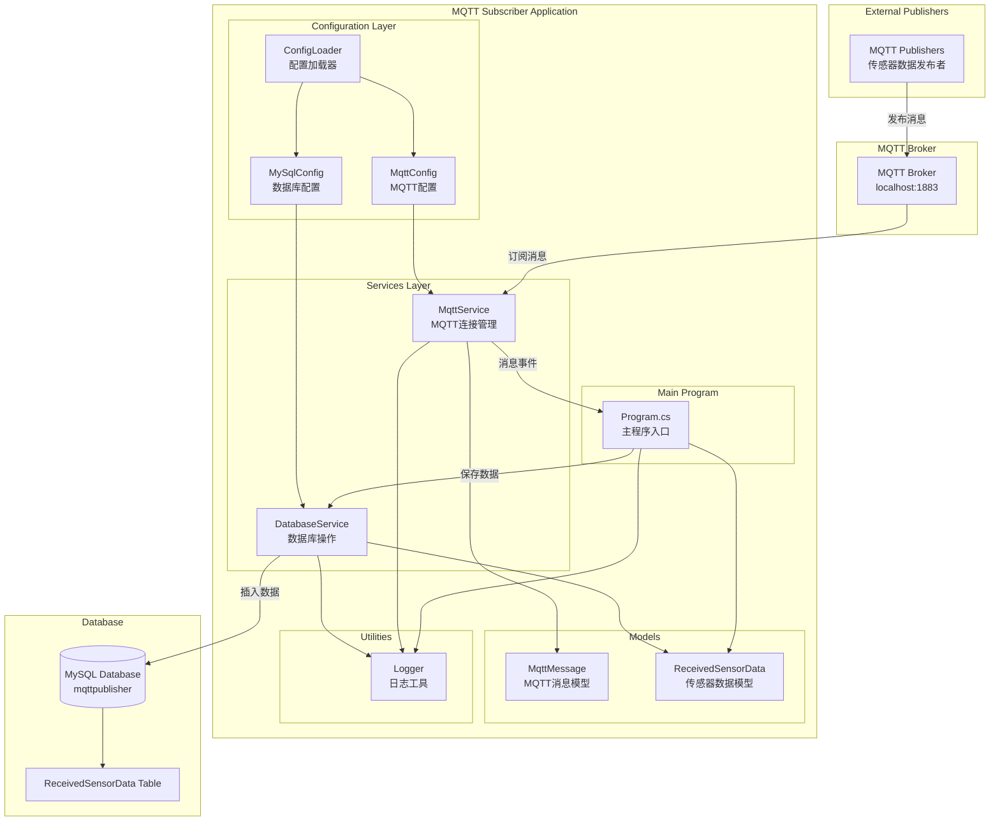
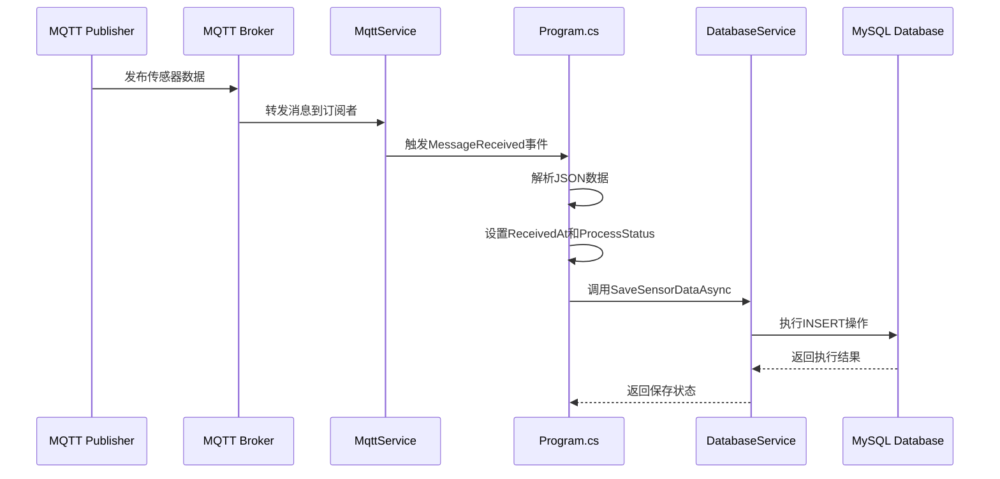

# MQTT订阅者系统

一个基于.NET 6的MQTT消息订阅者应用程序，用于接收传感器数据并存储到MySQL数据库中。

## 📋 项目概述

本项目是一个MQTT消息订阅者，专门用于：
- 连接到MQTT代理服务器
- 订阅传感器数据主题
- 接收并解析JSON格式的传感器数据
- 将数据存储到MySQL数据库中
- 提供完整的日志记录和错误处理

## 🏗️ 系统架构



## 🚀 快速开始

### 前置要求

- .NET 6.0 SDK
- MySQL 8.0+
- MQTT代理服务器（如Eclipse Mosquitto）

### 安装步骤

1. **克隆项目**
   ```bash
   git clone <repository-url>
   cd MqttSubscriber
   ```

2. **配置数据库**
   ```sql
   CREATE DATABASE mqttpublisher;
   USE mqttpublisher;
   
   CREATE TABLE ReceivedSensorData (
       Id INT AUTO_INCREMENT PRIMARY KEY,
       OriginalId INT NOT NULL,
       SensorId VARCHAR(100) NOT NULL,
       Value DECIMAL(10,2) NOT NULL,
       Timestamp DATETIME NOT NULL,
       Status VARCHAR(50),
       ReceivedAt DATETIME NOT NULL,
       ProcessStatus VARCHAR(50) DEFAULT 'pending'
   );
   ```

3. **配置应用程序**
   
   编辑 `appsettings.json` 文件：
   ```json
   {
     "MqttConfig": {
       "Server": "localhost",
       "Port": 1883,
       "Username": "admin",
       "Password": "admin",
       "ClientId": "DatabaseSubscriber",
       "SubscribeTopics": [ "sensors/data" ]
     },
     "MySqlConfig": {
       "Server": "localhost",
       "Port": 3306,
       "Database": "mqttpublisher",
       "UserId": "root",
       "Password": "root",
       "ConnectionTimeout": 30
     }
   }
   ```

4. **运行应用程序**
   ```bash
   dotnet run
   ```

## 📁 项目结构

```
MqttSubscriber/
├── Config/                 # 配置类
│   ├── MqttConfig.cs      # MQTT配置
│   └── MySqlConfig.cs     # MySQL配置
├── Models/                 # 数据模型
│   ├── MqttMessage.cs     # MQTT消息模型
│   └── ReceivedSensorData.cs # 传感器数据模型
├── Services/               # 服务层
│   ├── IMqttService.cs    # MQTT服务接口
│   ├── MqttService.cs     # MQTT服务实现
│   └── DatabaseService.cs # 数据库服务
├── Utilities/              # 工具类
│   ├── ConfigLoader.cs    # 配置加载器
│   └── Logger.cs          # 日志工具
├── Program.cs              # 主程序入口
├── appsettings.json        # 配置文件
└── MqttSubscriber.csproj   # 项目文件
```

## 🔧 配置说明

### MQTT配置 (MqttConfig)

| 参数 | 类型 | 默认值 | 说明 |
|------|------|--------|------|
| Server | string | localhost | MQTT代理服务器地址 |
| Port | int | 1883 | MQTT代理端口 |
| Username | string | admin | MQTT用户名 |
| Password | string | admin | MQTT密码 |
| ClientId | string | DatabaseSubscriber | MQTT客户端ID |
| SubscribeTopics | string[] | ["sensors/data"] | 订阅的主题列表 |

### MySQL配置 (MySqlConfig)

| 参数 | 类型 | 默认值 | 说明 |
|------|------|--------|------|
| Server | string | localhost | MySQL服务器地址 |
| Port | int | 3306 | MySQL端口 |
| Database | string | mqttpublisher | 数据库名称 |
| UserId | string | root | 数据库用户名 |
| Password | string | root | 数据库密码 |
| ConnectionTimeout | int | 30 | 连接超时时间（秒） |

## 📊 数据格式

### 接收的MQTT消息格式

```json
{
  "OriginalId": 1,
  "SensorId": "temp001",
  "Value": 25.5,
  "Timestamp": "2024-01-01T10:00:00",
  "Status": "active"
}
```

### 数据库存储格式

| 字段 | 类型 | 说明 |
|------|------|------|
| Id | INT | 自增主键 |
| OriginalId | INT | 原始消息ID |
| SensorId | VARCHAR(100) | 传感器ID |
| Value | DECIMAL(10,2) | 传感器数值 |
| Timestamp | DATETIME | 数据时间戳 |
| Status | VARCHAR(50) | 状态信息 |
| ReceivedAt | DATETIME | 接收时间 |
| ProcessStatus | VARCHAR(50) | 处理状态（默认：pending） |

## 🔄 消息处理流程



## 🛠️ 开发指南

### 添加新的消息类型

1. 在 `Models/` 目录下创建新的数据模型
2. 在 `Program.cs` 中的 `OnMessageReceived` 方法中添加解析逻辑
3. 在 `DatabaseService` 中添加相应的数据库操作方法

### 扩展订阅主题

修改 `appsettings.json` 中的 `SubscribeTopics` 数组：

```json
{
  "MqttConfig": {
    "SubscribeTopics": [
      "sensors/data",
      "sensors/temperature",
      "sensors/humidity"
    ]
  }
}
```

## 📝 日志说明

应用程序提供四种日志级别：

- **INFO**: 一般信息日志（白色）
- **SUCCESS**: 成功操作日志（绿色）
- **WARNING**: 警告日志（黄色）
- **ERROR**: 错误日志（红色）

日志格式：`[时间戳] 级别: 消息内容`

## 🚨 错误处理

应用程序包含完整的错误处理机制：

- **配置加载失败**: 使用默认配置继续运行
- **MQTT连接失败**: 记录错误并退出程序
- **消息解析失败**: 记录错误并继续处理下一条消息
- **数据库保存失败**: 记录错误并继续运行

## 📦 依赖项

- **MQTTnet** (4.3.7.1207): MQTT客户端库
- **MySql.Data** (8.4.0): MySQL数据库连接库
- **Microsoft.Extensions.Configuration** (8.0.0): 配置管理
- **Microsoft.Extensions.DependencyInjection** (8.0.1): 依赖注入

## 🤝 贡献指南

1. Fork 项目
2. 创建功能分支 (`git checkout -b feature/AmazingFeature`)
3. 提交更改 (`git commit -m 'Add some AmazingFeature'`)
4. 推送到分支 (`git push origin feature/AmazingFeature`)
5. 打开 Pull Request

## 📄 许可证

本项目采用 MIT 许可证 - 查看 [LICENSE](LICENSE) 文件了解详情。

## 📞 支持

如果您遇到任何问题或有任何建议，请：

1. 查看 [常见问题](docs/FAQ.md)
2. 提交 [Issue](../../issues)
3. 联系维护者

---

**注意**: 请确保在生产环境中使用强密码和安全的配置设置。
