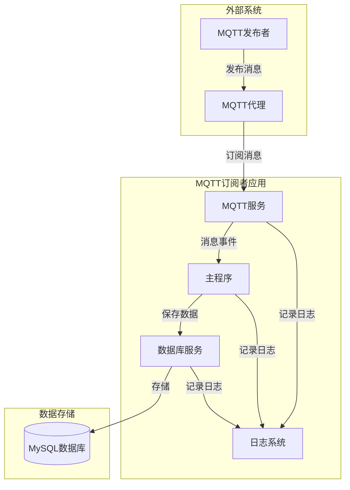
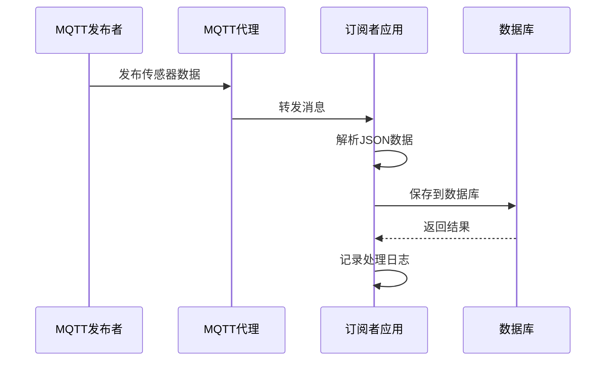

# 项目文档概览

## 📚 文档结构

本项目包含完整的文档体系，帮助您快速理解、部署和维护MQTT订阅者系统。

### 📋 主要文档

| 文档 | 描述 | 适用人群 |
|------|------|----------|
| [README.md](../README.md) | 项目主文档，包含快速开始指南 | 所有用户 |
| [architecture.md](architecture.md) | 系统架构图和组件说明 | 开发人员、架构师 |
| [data-flow.md](data-flow.md) | 数据流程图和消息处理流程 | 开发人员、运维人员 |
| [API.md](API.md) | 详细的API接口文档 | 开发人员 |
| [DEPLOYMENT.md](DEPLOYMENT.md) | 完整的部署指南 | 运维人员、DevOps |

## 🎯 快速导航

### 新用户入门
1. 阅读 [README.md](../README.md) 了解项目概述
2. 查看 [architecture.md](architecture.md) 理解系统架构
3. 按照 [DEPLOYMENT.md](DEPLOYMENT.md) 进行环境搭建

### 开发人员
1. 研究 [API.md](API.md) 了解接口设计
2. 分析 [data-flow.md](data-flow.md) 理解数据流
3. 参考 [architecture.md](architecture.md) 进行扩展开发

### 运维人员
1. 重点关注 [DEPLOYMENT.md](DEPLOYMENT.md) 部署指南
2. 查看 [data-flow.md](data-flow.md) 了解监控要点
3. 参考 [architecture.md](architecture.md) 进行故障排查

## 📊 系统架构概览



## 🔄 核心数据流



## 🛠️ 技术栈

- **.NET 6.0**: 主要开发框架
- **MQTTnet**: MQTT客户端库
- **MySQL**: 数据存储
- **Docker**: 容器化部署
- **Systemd**: Linux服务管理

## 📈 项目特点

- ✅ **高可靠性**: 完整的错误处理和重连机制
- ✅ **易扩展**: 模块化设计，易于添加新功能
- ✅ **易部署**: 支持多种部署方式
- ✅ **易监控**: 详细的日志记录和健康检查
- ✅ **高性能**: 异步处理和连接池优化

## 🚀 快速开始

### 1. 环境准备
```bash
# 安装 .NET 6.0
dotnet --version

# 启动 MQTT 代理 (Docker)
docker run -p 1883:1883 eclipse-mosquitto

# 启动 MySQL (Docker)
docker run -p 3306:3306 -e MYSQL_ROOT_PASSWORD=root mysql:8.0
```

### 2. 配置数据库
```sql
CREATE DATABASE mqttpublisher;
USE mqttpublisher;
CREATE TABLE ReceivedSensorData (
    Id INT AUTO_INCREMENT PRIMARY KEY,
    OriginalId INT NOT NULL,
    SensorId VARCHAR(100) NOT NULL,
    Value DECIMAL(10,2) NOT NULL,
    Timestamp DATETIME NOT NULL,
    Status VARCHAR(50),
    ReceivedAt DATETIME NOT NULL,
    ProcessStatus VARCHAR(50) DEFAULT 'pending'
);
```

### 3. 运行应用
```bash
git clone <repository-url>
cd MqttSubscriber
dotnet restore
dotnet run
```

## 📞 获取帮助

- 📖 查看详细文档
- 🐛 提交 [Issue](../../issues)
- 💬 参与讨论
- 📧 联系维护者

---

**提示**: 建议按照文档顺序阅读，从README开始，逐步深入了解系统架构和部署细节。
