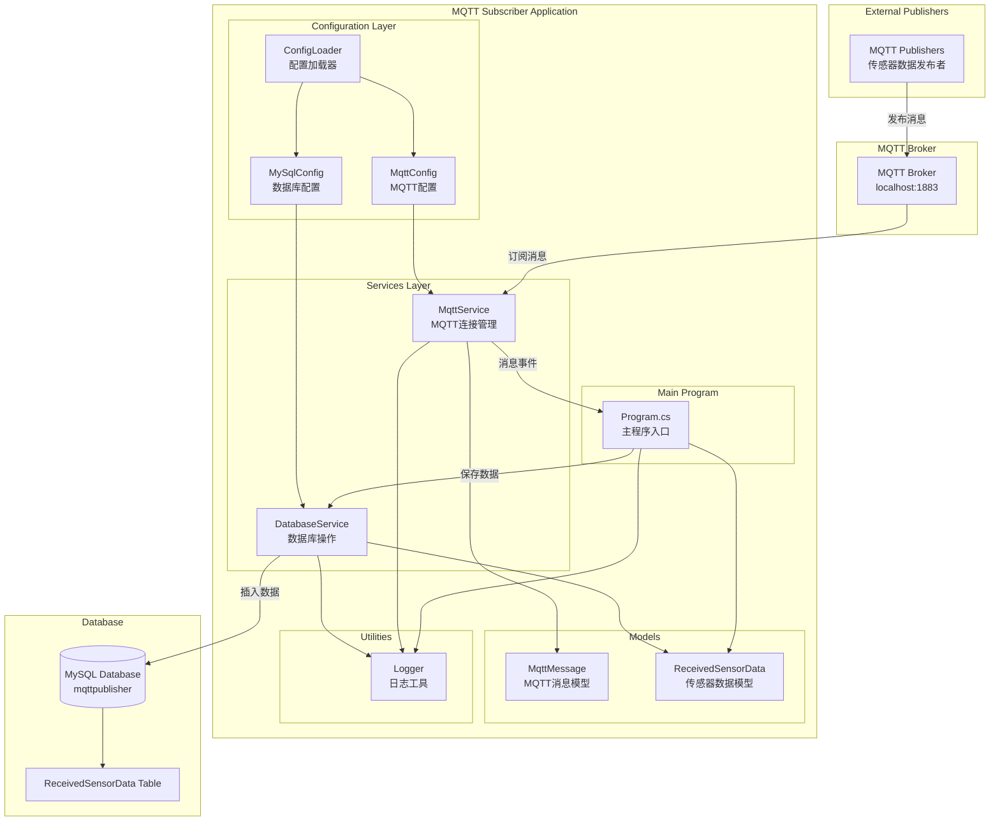

# MQTT订阅者系统架构

## 系统架构图

## 组件说明

### 1. 主程序 (Program.cs)
- **职责**: 应用程序入口点，协调各个组件
- **功能**:
  - 加载配置文件
  - 初始化MQTT和数据库服务
  - 处理消息接收事件
  - 管理应用程序生命周期

### 2. MQTT服务 (MqttService)
- **职责**: 管理MQTT连接和消息订阅
- **功能**:
  - 连接到MQTT代理
  - 订阅指定主题
  - 处理接收到的消息
  - 管理连接状态

### 3. 数据库服务 (DatabaseService)
- **职责**: 处理数据库操作
- **功能**:
  - 保存传感器数据到MySQL数据库
  - 管理数据库连接
  - 处理数据插入异常

### 4. 配置管理
- **MqttConfig**: MQTT连接配置
- **MySqlConfig**: MySQL数据库配置
- **ConfigLoader**: 配置文件加载器

### 5. 数据模型
- **MqttMessage**: MQTT消息结构
- **ReceivedSensorData**: 接收到的传感器数据结构

### 6. 工具类
- **Logger**: 控制台日志输出工具

## 数据流

1. **消息接收**: MQTT发布者发送传感器数据到MQTT代理
2. **消息订阅**: MqttService订阅指定主题并接收消息
3. **消息处理**: Program.cs处理接收到的消息，解析JSON数据
4. **数据保存**: DatabaseService将解析后的数据保存到MySQL数据库
5. **状态反馈**: 通过Logger输出处理状态和结果
