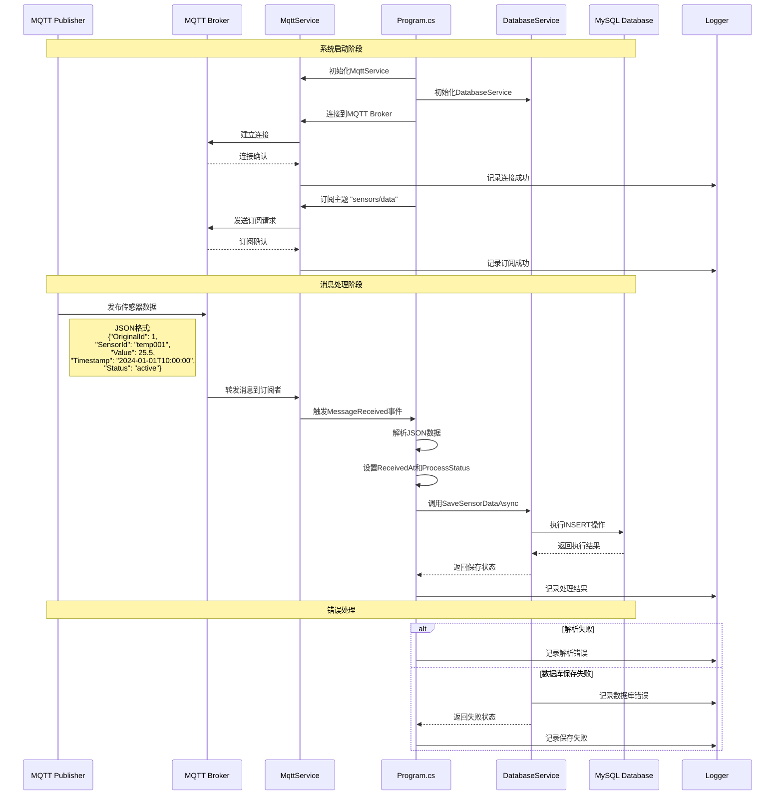
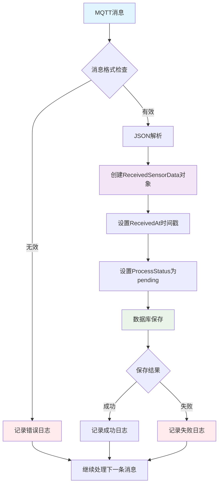
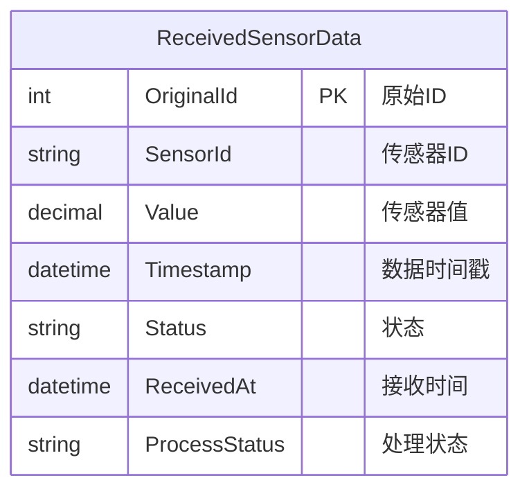
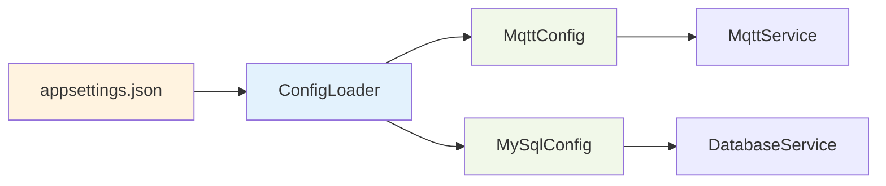
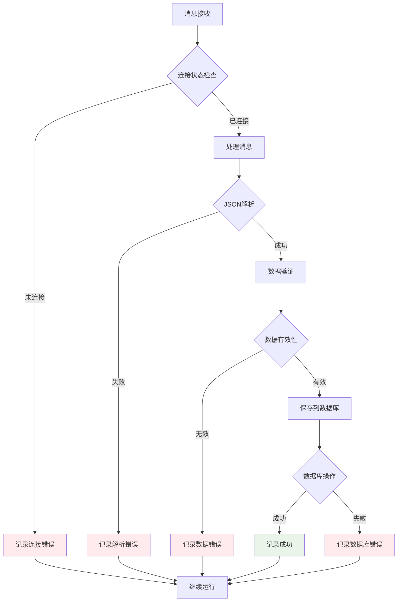

# 数据流程图

## 消息处理流程

```mermaid
sequenceDiagram
    participant EP as MQTT Publisher
    participant MB as MQTT Broker
    participant MS as MqttService
    participant P as Program.cs
    participant DS as DatabaseService
    participant DB as MySQL Database
    participant L as Logger

    Note over EP,DB: 系统启动阶段
    P->>MS: 初始化MqttService
    P->>DS: 初始化DatabaseService
    P->>MS: 连接到MQTT Broker
    MS->>MB: 建立连接
    MB-->>MS: 连接确认
    MS->>L: 记录连接成功
    P->>MS: 订阅主题 "sensors/data"
    MS->>MB: 发送订阅请求
    MB-->>MS: 订阅确认
    MS->>L: 记录订阅成功

    Note over EP,DB: 消息处理阶段
    EP->>MB: 发布传感器数据
    Note right of EP: JSON格式:<br/>{"OriginalId": 1,<br/>"SensorId": "temp001",<br/>"Value": 25.5,<br/>"Timestamp": "2024-01-01T10:00:00",<br/>"Status": "active"}
    
    MB->>MS: 转发消息到订阅者
    MS->>P: 触发MessageReceived事件
    P->>P: 解析JSON数据
    P->>P: 设置ReceivedAt和ProcessStatus
    P->>DS: 调用SaveSensorDataAsync
    DS->>DB: 执行INSERT操作
    DB-->>DS: 返回执行结果
    DS-->>P: 返回保存状态
    P->>L: 记录处理结果

    Note over EP,DB: 错误处理
    alt 解析失败
        P->>L: 记录解析错误
    else 数据库保存失败
        DS->>L: 记录数据库错误
        DS-->>P: 返回失败状态
        P->>L: 记录保存失败
    end
```

## 数据转换流程

```mermaid
flowchart TD
    A[MQTT消息] --> B{消息格式检查}
    B -->|有效| C[JSON解析]
    B -->|无效| D[记录错误日志]
    
    C --> E[创建ReceivedSensorData对象]
    E --> F[设置ReceivedAt时间戳]
    F --> G[设置ProcessStatus为pending]
    
    G --> H[数据库保存]
    H --> I{保存结果}
    I -->|成功| J[记录成功日志]
    I -->|失败| K[记录失败日志]
    
    D --> L[继续处理下一条消息]
    J --> L
    K --> L
    
    style A fill:#e1f5fe
    style E fill:#f3e5f5
    style H fill:#e8f5e8
    style D fill:#ffebee
    style K fill:#ffebee
```

## 数据库表结构

```mermaid
erDiagram
    ReceivedSensorData {
        int OriginalId PK "原始ID"
        string SensorId "传感器ID"
        decimal Value "传感器值"
        datetime Timestamp "数据时间戳"
        string Status "状态"
        datetime ReceivedAt "接收时间"
        string ProcessStatus "处理状态"
    }
```

## 配置数据流

```mermaid
flowchart LR
    A[appsettings.json] --> B[ConfigLoader]
    B --> C[MqttConfig]
    B --> D[MySqlConfig]
    C --> E[MqttService]
    D --> F[DatabaseService]
    
    style A fill:#fff3e0
    style B fill:#e3f2fd
    style C fill:#f1f8e9
    style D fill:#f1f8e9
```

## 错误处理流程

```mermaid
flowchart TD
    A[消息接收] --> B{连接状态检查}
    B -->|已连接| C[处理消息]
    B -->|未连接| D[记录连接错误]
    
    C --> E{JSON解析}
    E -->|成功| F[数据验证]
    E -->|失败| G[记录解析错误]
    
    F --> H{数据有效性}
    H -->|有效| I[保存到数据库]
    H -->|无效| J[记录数据错误]
    
    I --> K{数据库操作}
    K -->|成功| L[记录成功]
    K -->|失败| M[记录数据库错误]
    
    D --> N[继续运行]
    G --> N
    J --> N
    L --> N
    M --> N
    
    style D fill:#ffebee
    style G fill:#ffebee
    style J fill:#ffebee
    style M fill:#ffebee
    style L fill:#e8f5e8
```
