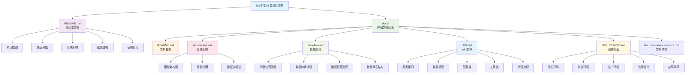

# 文档结构图

## 项目文档组织架构



## 文档阅读路径

### 🚀 新用户路径
```
README.md → docs/README.md → architecture.md → DEPLOYMENT.md
```

### 👨‍💻 开发人员路径
```
README.md → architecture.md → API.md → data-flow.md
```

### 🔧 运维人员路径
```
README.md → DEPLOYMENT.md → data-flow.md → architecture.md
```

### 🏗️ 架构师路径
```
architecture.md → data-flow.md → API.md → DEPLOYMENT.md
```

## 文档特点

### 📊 可视化图表
- 系统架构图 (Mermaid)
- 数据流程图 (Mermaid)
- 组件关系图 (Mermaid)
- 部署架构图 (Mermaid)

### 📝 详细说明
- 完整的API接口文档
- 详细的配置参数说明
- 逐步的部署指南
- 全面的故障排除方案

### 🎯 实用性强
- 快速开始指南
- 代码示例
- 配置文件模板
- 最佳实践建议

## 维护指南

### 文档更新原则
1. **及时性**: 代码变更时同步更新文档
2. **准确性**: 确保文档内容与实际代码一致
3. **完整性**: 覆盖所有重要功能和配置
4. **易读性**: 使用清晰的结构和语言

### 版本控制
- 文档版本与代码版本保持一致
- 重大变更时更新版本号
- 保留历史版本供参考

### 反馈机制
- 提供文档反馈渠道
- 定期收集用户建议
- 持续改进文档质量
